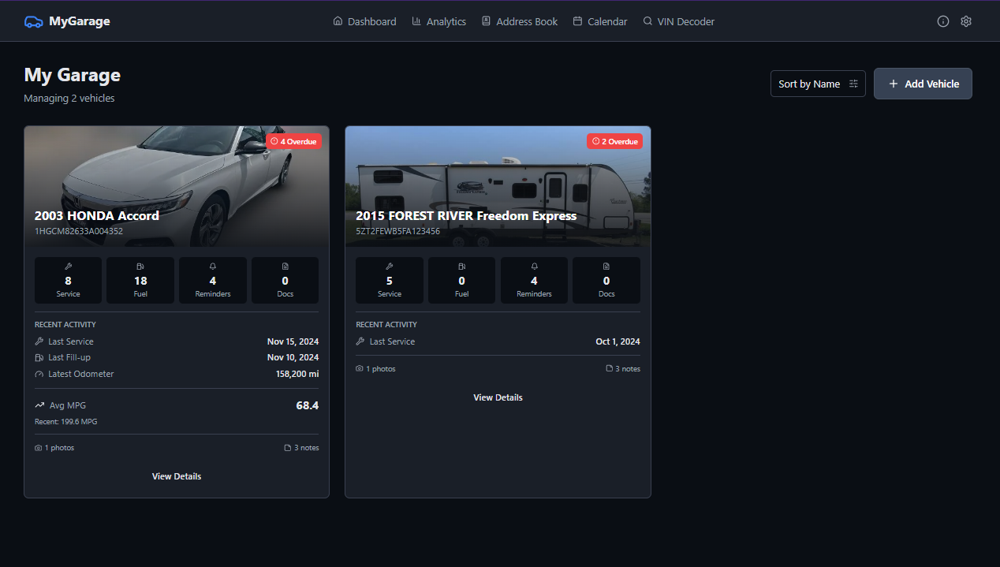

<div align="center">
  
Self-hosted vehicle maintenance tracking with VIN decoding, service records, fuel logging, and document management.

[](https://github.com/homelabforge/mygarage/actions/workflows/ci.yml)
[](https://github.com/homelabforge/mygarage/actions/workflows/codeql.yml)
[](https://github.com/homelabforge/mygarage/actions/workflows/publish.yml)
[](TRANSLATIONS.md)

[](https://github.com/homelabforge/mygarage/pkgs/container/mygarage)
[](https://www.python.org)
[](https://react.dev)
[&label=Bun&color=000000&logo=bun&logoColor=white&prefix=v)](https://bun.sh)
[](LICENSE)
[](https://discord.gg/6XttnVgG)



</div>

---

## Key Features

- **VIN Decoding** - Automatic vehicle details via NHTSA API
- **Service Visits** - Track maintenance with line items, tax/fees, and attachments
- **Maintenance Scheduling** - Proactive maintenance tracking with due date/mileage alerts
- **LiveLink Telemetry** - Real-time OBD2 data via WiCAN devices (HTTPS POST or MQTT). See [LiveLink (WiCAN) Setup](docs/LIVELINK_SETUP.md).
- **POI Finder** - Discover nearby auto shops, EV charging, and fuel stations with interactive map
- **Fuel Tracking** - Log fill-ups with automatic MPG calculations
- **Fifth Wheel & Trailer Support** - Propane tracking, spot rental billing, and RV park management
- **Unit Conversion** - Imperial/Metric units with per-user preferences
- **Document Management** - Store registration, insurance, manuals with OCR
- **Family Multi-User System** - Separate accounts with vehicle sharing, ownership transfers, and family dashboard
- **Authentication Options** - No auth, local JWT, or OIDC (Authentik, Keycloak, Google, Azure AD)
- **Self-Hosted** - Your data stays on your infrastructure

---

**Default Mode**: Runs with no authentication for easy setup. Configure authentication in Settings before exposing to the internet.

📖 **[Complete Installation Guide](https://github.com/homelabforge/mygarage/wiki/Installation)**

---

## Subpath Reverse Proxy

To host MyGarage behind a reverse proxy at a URL prefix (e.g., `https://example.com/mygarage`), set `MYGARAGE_ROOT_PATH=/mygarage` and configure your proxy to **strip the prefix** before forwarding requests.

### nginx Configuration

```nginx
location = /mygarage { return 308 /mygarage/; }   # bare prefix -> trailing slash
location /mygarage/ {
    proxy_pass http://mygarage:8686/;             # trailing slash strips /mygarage
    proxy_set_header Host $host;
    proxy_set_header X-Forwarded-Proto $scheme;
    proxy_set_header X-Forwarded-Host $host;
}
```

### Traefik Configuration

```yaml
# Traefik dynamic config — router MUST attach the strip middleware,
# plus a redirect so the bare /mygarage lands inside the /mygarage/ SW scope.
http:
  routers:
    mygarage:
      rule: "Host(`example.com`) && PathPrefix(`/mygarage`)"
      middlewares: ["mygarage-bare-redirect", "mygarage-strip"]
      service: mygarage
  middlewares:
    mygarage-bare-redirect:
      redirectRegex:
        regex: "^(https?://[^/]+)/mygarage$"
        replacement: "${1}/mygarage/"
        permanent: true
    mygarage-strip:
      stripPrefix:
        prefixes: ["/mygarage"]
```

**OIDC Note:** When registering the OIDC redirect URI with your identity provider, include the prefix in the full path: `https://example.com/mygarage/api/auth/oidc/callback`.

---

## Support

- **📚 Documentation**: [GitHub Wiki](https://github.com/homelabforge/mygarage/wiki)
- **🌐 Website**: [homelabforge.io/builds/mygarage](https://homelabforge.io/builds/mygarage/)
- **🐛 Bug Reports**: [GitHub Issues](https://github.com/homelabforge/mygarage/issues)
- **💬 Discussions**: [GitHub Discussions](https://github.com/homelabforge/mygarage/discussions)

---

## Translations

See [Translation Status](TRANSLATIONS.md) for language support and how to contribute.

---

## License

MIT License - see [LICENSE](LICENSE) file for details.

---

## Acknowledgments

Built for homelabbers who want to track vehicle maintenance without sending data to third-party services.

VIN decoding powered by the [NHTSA vPIC API](https://vpic.nhtsa.dot.gov/).

### Development Assistance

MyGarage was developed through AI-assisted pair programming with **Claude** and **Codex**, combining human vision with AI capabilities for architecture, security patterns, and implementation.
