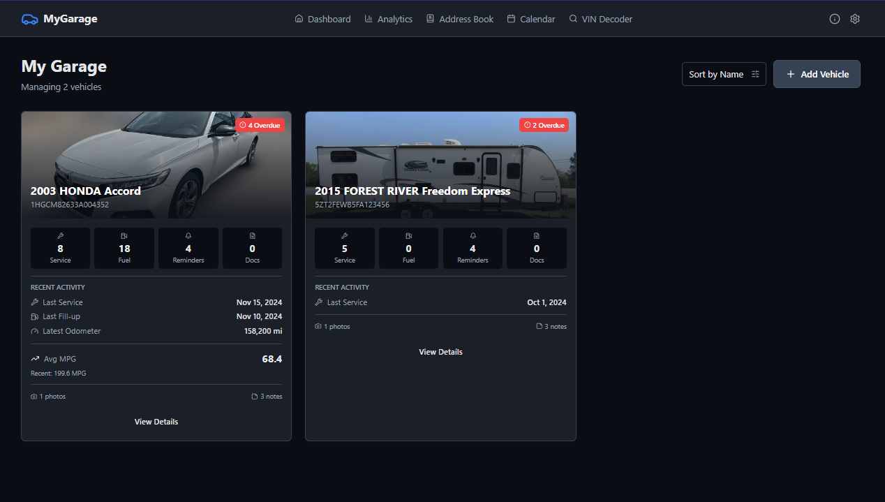

  
Self-hosted vehicle maintenance tracking with VIN decoding, service records, fuel logging, and document management.

[&label=Bun&color=000000&logo=bun&logoColor=white&prefix=v)](https://bun.sh)

---

## Key Features

- **VIN Decoding** - Automatic vehicle details via NHTSA API
- **Service Visits** - Track maintenance with line items, tax/fees, and attachments
- **Maintenance Specs** - Oil viscosity, capacity and filter, fuel filter, lug-nut torque, and coolant/brake/transmission fluid per vehicle
- **Reminders** - Date, mileage, or engine-hours maintenance reminders with due alerts
- **Tire Tracking** - Tread, DOT and pressure readings per position, with mount periods, rotation, seasonal sets, storage, and wear projection
- **LiveLink Telemetry** - Real-time OBD2 data, movement-detected drive sessions, GPS trips, and DTCs via a WiCAN device (HTTPS POST or MQTT) or the Torque Pro app. See [LiveLink (WiCAN) Setup](docs/LIVELINK_SETUP.md).
- **POI Finder** - Discover nearby auto shops, EV charging, and fuel stations with interactive map
- **Fuel & DEF Tracking** - Log fill-ups (and DEF for diesels) and analyze fuel economy trends
- **EV & PHEV Charging** - Charge sessions with start/end SOC, charge level, location, and battery health
- **Engine Hours Tracking** - Hour meters for ATVs, equipment, and generators, with hours-based reminders
- **Parts & Supplies** - Track fluids, filters and parts on hand; their cost folds into service visits
- **Fifth Wheel & Trailer Support** - Propane tracking, spot rental billing, and RV park management
- **Unit Conversion** - Imperial, metric, or a mix: units are chosen per quantity, so litres with miles is a real setting
- **Document Management** - Store registration, insurance, manuals with OCR
- **Imports & Webhooks** - Fuelio, Drivvo and Tesla/ABRP CSV imports, inbound webhooks, and Telegram fuel commands
- **Family Multi-User System** - Separate accounts with vehicle sharing, ownership transfers, and family dashboard
- **Languages & Currencies** - English, German, French, Polish, Brazilian Portuguese, Russian, Ukrainian; 16 currencies
- **Authentication Options** - No auth, local JWT, or OIDC (Authentik, Keycloak, Google, Azure AD)
- **Ask My Garage** - Opt-in assistant answering questions from your own specs, service history and DTCs. See [Tier 2 Features](docs/tier2-features.md).
- **Self-Hosted** - Your data stays on your infrastructure

---

**Default Mode**: Runs with no authentication for easy setup. Configure authentication in Settings before exposing to the internet.

📖 **[Complete Installation Guide](https://github.com/homelabforge/mygarage/wiki/Installation)**

---

## Support

- **📚 Documentation**: [GitHub Wiki](https://github.com/homelabforge/mygarage/wiki)
- **🌐 Website**: [homelabforge.io/builds/mygarage](https://homelabforge.io/builds/mygarage/)
- **🐛 Bug Reports**: [GitHub Issues](https://github.com/homelabforge/mygarage/issues)
- **💬 Discussions**: [GitHub Discussions](https://github.com/homelabforge/mygarage/discussions)

---

## Translations

See [Translation Status](TRANSLATIONS.md) for language support and how to contribute.

---

## License

MIT License - see [LICENSE](LICENSE) file for details.

---

## Acknowledgments

Built for homelabbers who want to track vehicle maintenance without sending data to third-party services.

VIN decoding powered by the [NHTSA vPIC API](https://vpic.nhtsa.dot.gov/).

### Development Assistance

MyGarage was developed through AI-assisted pair programming with **Claude** and **Codex**, combining human vision with AI capabilities for architecture, security patterns, and implementation.
