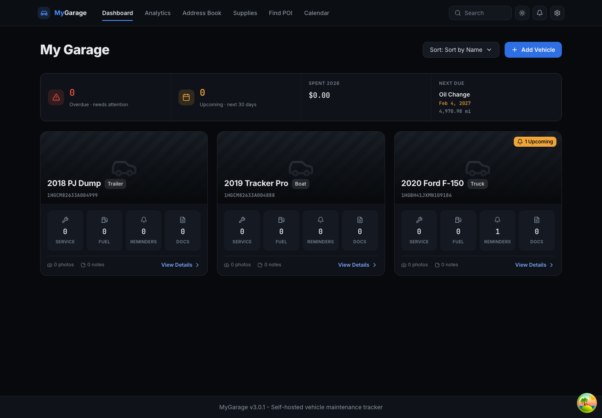
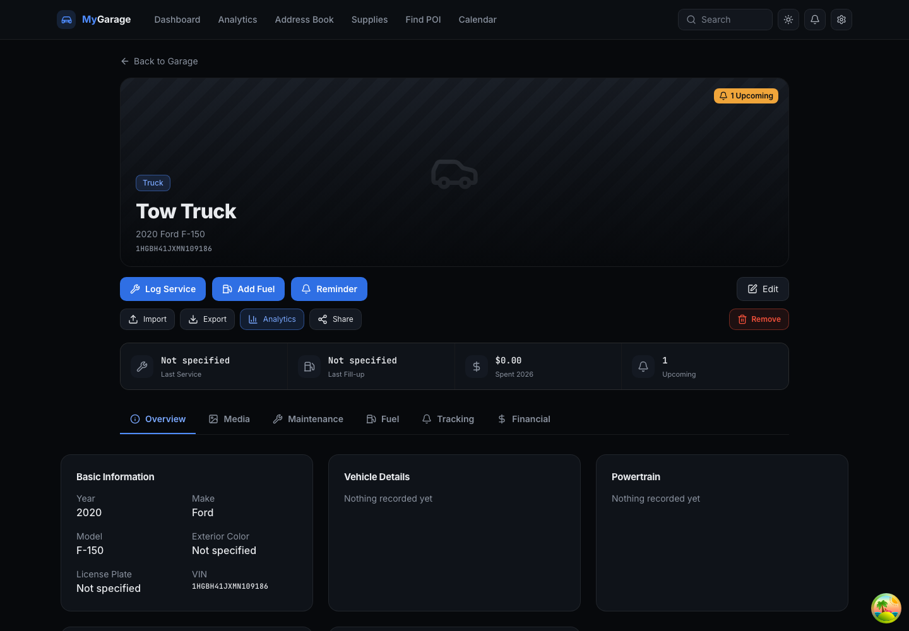
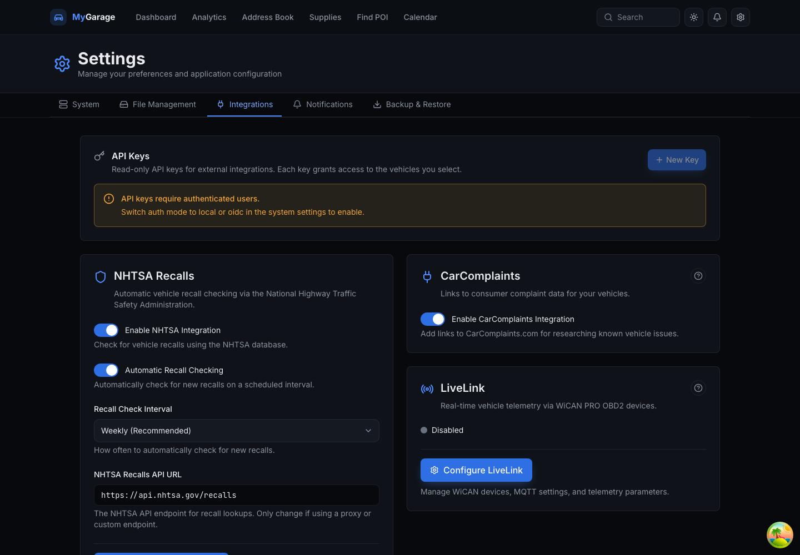
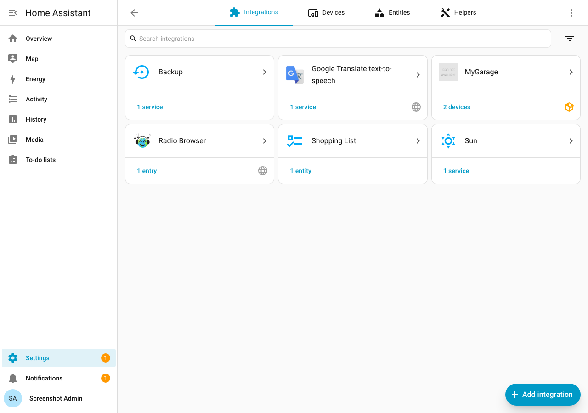
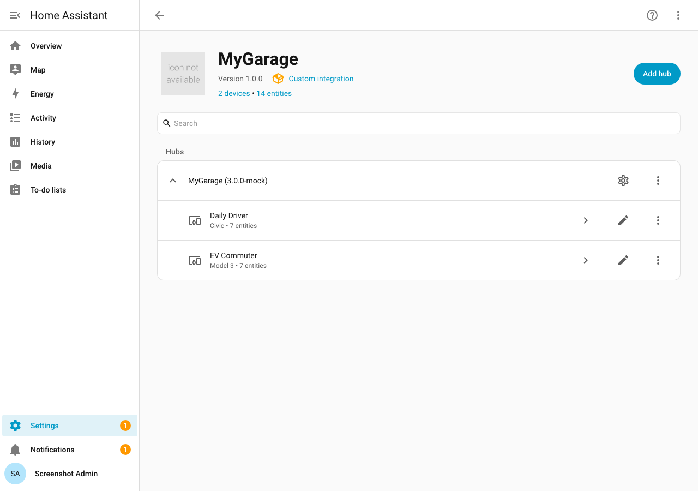
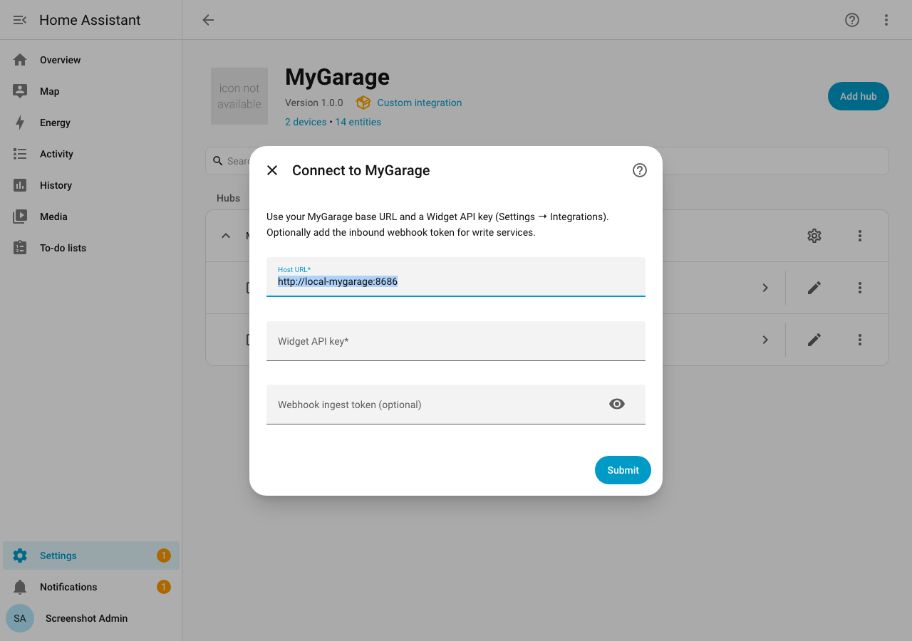
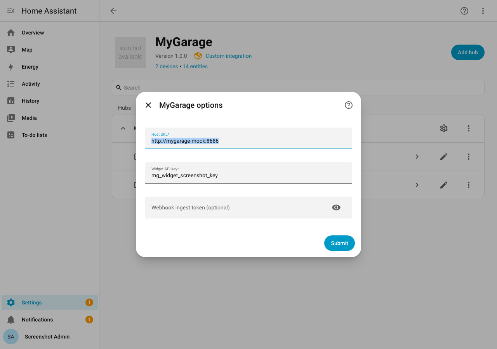
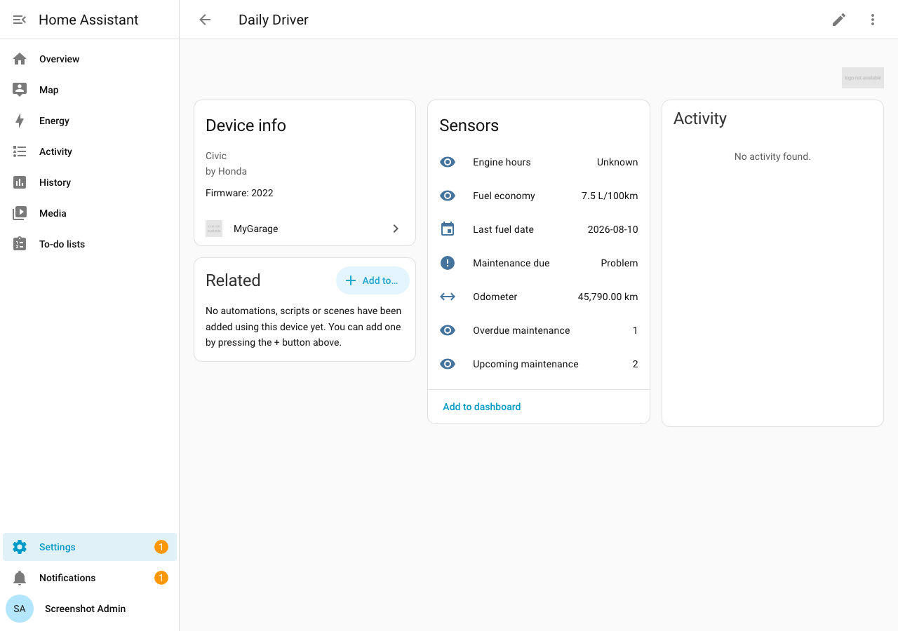
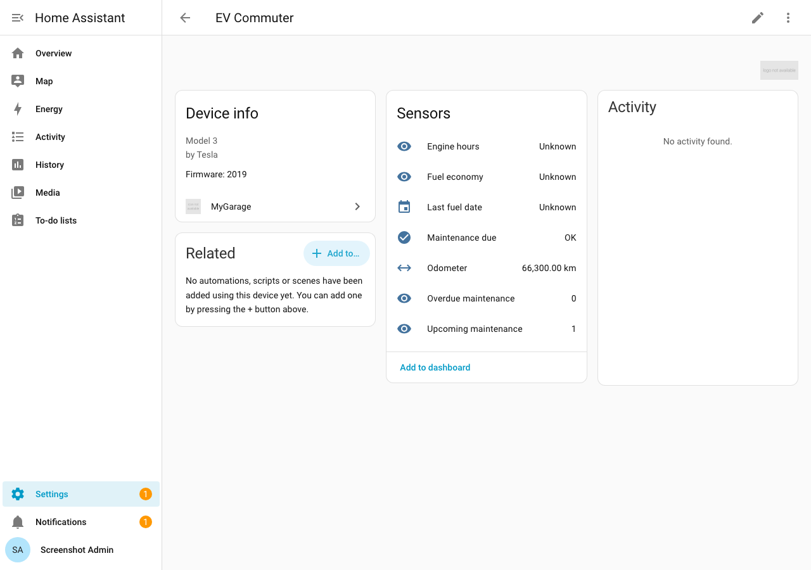

# Home Assistant integration

MyGarage ships a **Supervisor add-on** (`homeassistant/addon`) and a **HACS custom integration** (`custom_components/mygarage`).

## Screenshots

### MyGarage app (add-on / Ingress UI)

| Dashboard | Vehicle |
|---|---|
| [](../screenshots/pr/ha-packaging/app-dashboard.png) | [](../screenshots/pr/ha-packaging/app-vehicle.png) |

| Settings → Integrations |
|---|
| [](../screenshots/pr/ha-packaging/app-integrations.png) |

### HACS integration (Home Assistant)

| Integrations | Integration detail |
|---|---|
| [](../screenshots/pr/ha-packaging/integrations.png) | [](../screenshots/pr/ha-packaging/integration-detail.png) |

| Connect / config flow | Options |
|---|---|
| [](../screenshots/pr/ha-packaging/config-flow.png) | [](../screenshots/pr/ha-packaging/options-menu.png) |

| Vehicle device (ICE) | Vehicle device (EV) |
|---|---|
| [](../screenshots/pr/ha-packaging/vehicle-device.png) | [](../screenshots/pr/ha-packaging/vehicle-ev.png) |

### Refreshing screenshots

**HACS integration (HA UI):**

```bash
docker compose -f docker-compose.ha.yml up -d
python3 scripts/setup_ha_screenshots.py
export HA_REFRESH_TOKEN="$(cat docker_data/ha_refresh_token.txt)"
python3 scripts/capture_ha_screenshots.py
```

**MyGarage app UI** (backend on `:8686`, frontend on `:3000`):

```bash
python3 scripts/capture_ha_app_screenshots.py
```

Requires Playwright and the `ha-integration-screenshots` skill script at
`~/.cursor/skills/ha-integration-screenshots/scripts/capture_ha_screenshots.py`.
Never commit `docker_data/` or tokens.

## Architecture

| Piece | Role |
|-------|------|
| Add-on (`homeassistant/addon`) | Runs the published MyGarage container with Ingress on port 8686 |
| Integration (`custom_components/mygarage`) | Polls `/api/v2/widget/*` with `X-API-Key`; optional write services via `/api/v1/webhooks/*` |

MyGarage remains the source of truth. The integration is a thin, local-polling bridge — not a second garage database.

## Install the add-on

1. Settings → Add-ons → Add-on store → ⋮ → Repositories
2. Add this repository URL
3. Install **MyGarage**, start it, open via Ingress
4. Create a Widget API key in MyGarage → Settings → Integrations
5. (Optional) Set **Webhook ingest token** in Settings → Integrations for HA write services

## Install the HACS integration

1. HACS → Custom repositories → add this repo as **Integration**
2. Download **MyGarage**, restart Home Assistant
3. Settings → Devices & Services → Add Integration → MyGarage
4. Host (add-on): `http://local-mygarage:8686` (or your reverse-proxy URL)
5. Paste the Widget API key; optionally the webhook token

## Entities & events

- Sensors: odometer (km), fuel economy (L/100km), overdue/upcoming counts, last fuel date, engine hours
- Binary sensor: maintenance due
- Events: `mygarage.due_soon`, `mygarage.overdue`

## Services

Requires the webhook ingest token:

- `mygarage.log_fuel`
- `mygarage.set_odometer`
- `mygarage.complete_reminder`

## Telegram structured fuel entry

1. Enable Telegram notifications (bot token + chat id)
2. Set `telegram_inbound_enabled=true` and configure `webhook_ingest_token`
3. Point BotFather webhook to `https://<host>/api/v1/webhooks/telegram?token=<webhook_ingest_token>`
4. Send: `fuel <vin|nickname> <odometer>[km|mi] <volume>[L|gal|kWh] [price] [cost]`
